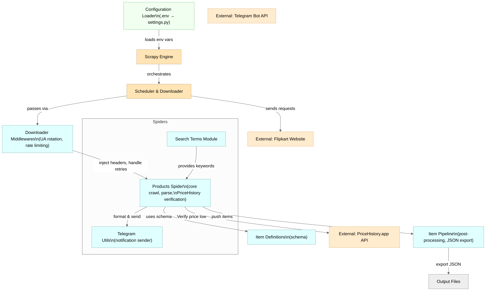

# Flipkart Price Tracker

[](LICENSE)  
[](https://pypi.org/project/scrapy/)  

## Project Overview

**Flipkart Price Tracker** is a Scrapy‑based spider that searches Flipkart for steep discounts (>80%), verifies real‑time deals against historical price data from PriceHistory.app, and notifies you via Telegram when you find a product at its all‑time low. Ideal for bargain hunters, deal‑aggregators, and developers learning advanced web‑scraping patterns.

## Features

- 🔍 Multi‑category, randomized Flipkart searches  
- ⚡ Handles three common Flipkart result layouts  
- 📊 Extracts title, current price & discount percentage  
- 🔗 Verifies deals via PriceHistory.app’s API & price page  
- 💬 Sends Telegram alerts for genuine all‑time‑low products  
- 🌐 Rotates User‑Agents, custom headers & respects rate limits  
- 🛠️ Robust error handling & retry logic for HTTP and timeouts  
- ⚙️ Configurable search terms, thresholds, page limits  

## Getting Started

### Prerequisites

- Python 3.8+  
- `git` CLI  
- A Telegram Bot Token & Chat ID  
- (Optional) Docker for containerized runs  

### Installation

```bash
git clone https://github.com/kayden-vs/flipkart-scraper.git
cd flipkart-scraper
python -m venv .venv
source .venv/bin/activate      # Windows: .venv\Scripts\activate
pip install -r requirements.txt
```

### Configuration

Create a `.env` file in the project root:

```ini
TELEGRAM_BOT_TOKEN=your_bot_token_here
TELEGRAM_CHAT_ID=your_chat_id_here
```

- **TELEGRAM_BOT_TOKEN**: The token from BotFather.  
- **TELEGRAM_CHAT_ID**: Your Telegram chat or group ID.

### Quick Start

```bash
# Run the spider
scrapy crawl products
```

For verbose logs:

```bash
scrapy crawl products -L DEBUG
```

Save results to JSON:

```bash
scrapy crawl products -o deals.json
```

## Architecture


- **products spider** (`flipkart/flipkart/spiders/products.py`): searches Flipkart, parses deals, verifies historical prices, and sends Telegram alerts.
- **search_terms** (`flipkart/flipkart/spiders/search_terms.py`): defines search keywords used by the spider.
- **telegram_utils** (`flipkart/flipkart/telegram_utils.py`): sends formatted Telegram messages.
- **middlewares** (`flipkart/flipkart/middlewares.py`): rotates user-agents and injects headers.
- **pipelines** (`flipkart/flipkart/pipelines.py`): processes scraped items (no-op placeholder by default).
- **settings** (`flipkart/flipkart/settings.py`): Scrapy configuration for delays, retries, and extensions.

## Folder Structure

```
flipkart-scraper/
├─ scrapy.cfg                 # Scrapy project config
├─ requirements.txt           # Pinned Python dependencies
├─ flipkart/                  # Main Scrapy package
│  ├─ flipkart/               # Spider modules & settings
│  └─ project.egg-info/       # Metadata
```

## Environment Variables

| Variable               | Description                                     |
|------------------------|-------------------------------------------------|
| `TELEGRAM_BOT_TOKEN`   | Your Telegram Bot API token                     |
| `TELEGRAM_CHAT_ID`     | Chat or group ID to receive notifications       |
| `DOWNLOAD_DELAY`       | Delay between requests (default: 1s)            |
| `RETRY_HTTP_CODES`     | HTTP codes that trigger automatic retry         |

## Roadmap & Future Work

- 🔄 **Proxy Support**: Integrate rotating proxies to avoid IP bans.  
- 🐳 **Dockerization**: Containerize spider & scheduler for easy deployment.  
- 🧪 **Unit Tests**: Add `pytest` fixtures for selectors & utils.  

## Contributing

1. Fork the repo  
2. Create a feature branch: `git checkout -b feature/YourFeature`  
3. Commit changes: `git commit -m "feat: add ..."`  
4. Push: `git push origin feature/YourFeature`  
5. Open a Pull Request

Please follow PEP 8, include tests for new features, and reference related issues.

## ⚠️ Disclaimer

This project is for **educational purposes only**. Web scraping may violate Terms of Service of websites. Use responsibly with appropriate request delays. Not affiliated with or endorsed by Flipkart or PriceHistory.app.

## License

This project is licensed under the MIT License – see [LICENSE](LICENSE) for details.

## Acknowledgements

- [Scrapy](https://scrapy.org/) – The heart of this spider  
- [fake-useragent](https://pypi.org/project/fake-useragent/) – Dynamic User‑Agent rotation  
- [python-dotenv](https://github.com/theskumar/python-dotenv) – Environment variable loading  
- [PriceHistory.app](https://pricehistory.app/) – Historical price data API  
- Icons by [Feather](https://feathericons.com/)
